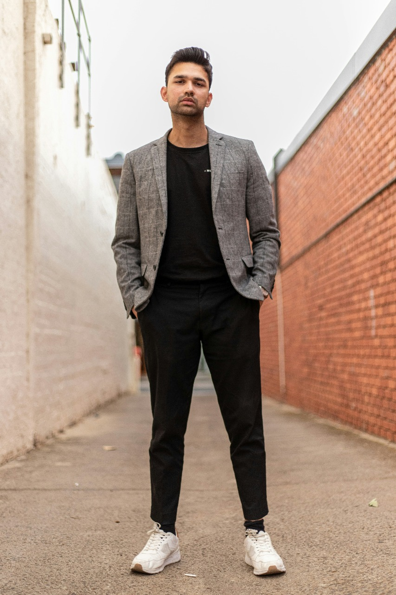
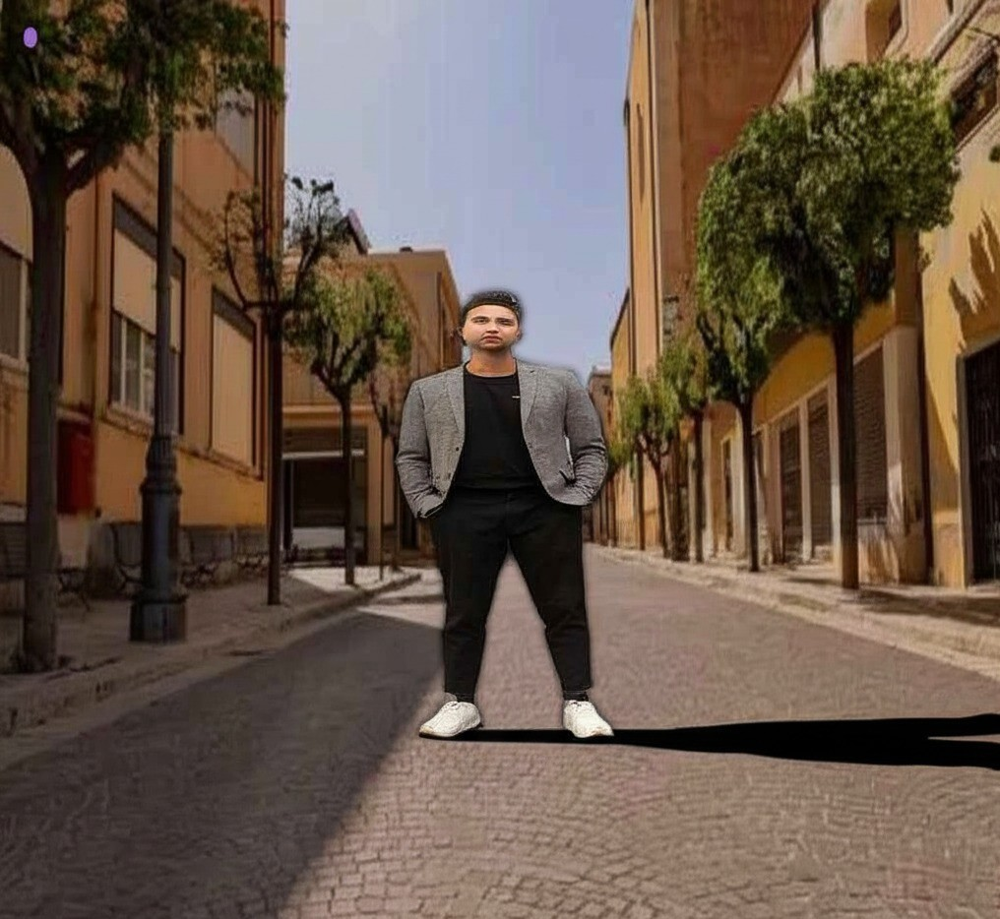
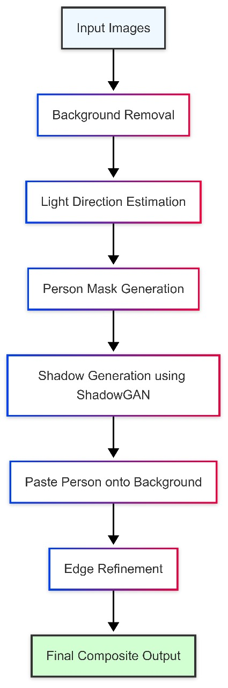

# 🖼️ Photorealistic Person Compositing with ShadowGAN

This project creates **realistic image composites** by placing a person into a background and generating **natural-looking shadows** using GANs. It ensures seamless blending and photorealism through shadow synthesis and edge refinement.

---

## 🔰 Input and Output Images

### 🎯 Input Images
- `person.jpg` → Image of person (with background)
- `back.png` → Target background image

### ✅ Output Image
- `final_composite.png` → Final result with person, background, and shadow

| Person Image | Background Image | Final Output |
|--------------|------------------|---------------|
|  |  |  |

---

## 🔄 Flowchart Overview

The entire process is summarized in the diagram below:

> 📌 *The flowchart shows major steps: background removal → light estimation → shadow generation → blending → refinement.*

---

## ⚙️ How It Works (Key Steps)

- 🔍 **Background Removal**: Cut the person from the original image using `rembg`.
- 💡 **Light Estimation**: Analyze lighting in `back.png` to set correct shadow direction.
- 🖤 **Shadow Generation**: Use **ShadowGAN** to generate a shadow from the person’s mask.
- 🧵 **Blending**: Paste the cutout on the background with shadow, using alpha blending.
- ✨ **Refinement**: Smooth edges with feathering for a more natural look.

---

## 💡 Tech Stack

- Python + OpenCV + NumPy
- rembg (background removal)
- Mask ShadowGAN (shadow synthesis)
- PIL (for image manipulation)

---

## 📁 Files in Repo

